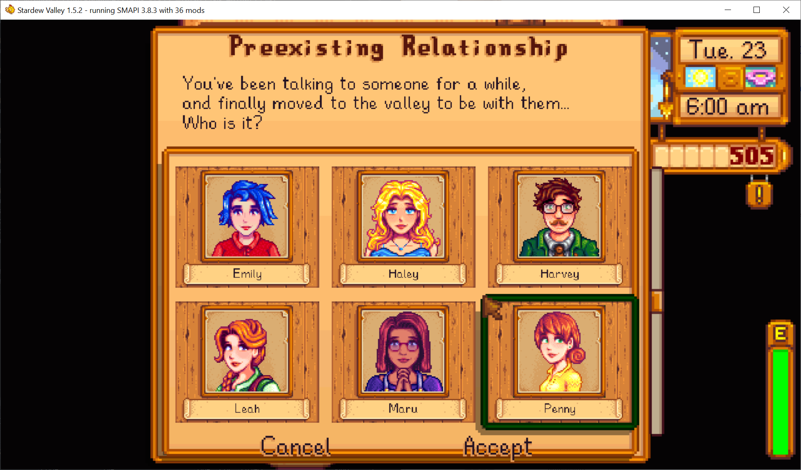

**Preexisting Relationship Redux** is a [Stardew Valley](http://stardewvalley.net/) mod which lets
you start the game already married to an NPC.

This is a substantial rewrite of [**Preexisting Relationship**](https://www.nexusmods.com/stardewvalley/mods/8989)
by [spacechase0](https://github.com/spacechase0), originally released under the MIT License.
Rewritten for Stardew Valley 1.6+ by tbonehunter.

## Changes in 2.0.0
* Rewritten and renamed from *Preexisting Relationship* to *Preexisting Relationship Redux*.
* Updated for Stardew Valley 1.6 and SMAPI 4.0+.
* Removed SpaceCore / SpaceShared dependency — now fully standalone.
* Rewrote marriage selection menu using vanilla game UI components.
* Fixed deprecated API calls (`Game1.getFarmer`, house upgrade methods, etc.).

## Install
1. Install the latest version of [SMAPI](https://smapi.io).
2. Install this mod into your `Stardew Valley/Mods` folder.
3. Run the game using SMAPI.

## Use
Start a new save (or load an unmarried save), and when the day starts you'll see a menu asking who
you're married to. You'll start with the first house upgrade (so they have their spouse room), and
heart events will still trigger like usual.

You can also type `marry` in the SMAPI console to reopen the menu at any time (if unmarried).

## Compatibility
Compatible with Stardew Valley 1.6+ on Linux/macOS/Windows, both single-player and multiplayer.

Works with mods that add datable NPCs (including NPCMarriageable).

## See also
* [Release notes](release-notes.md)
